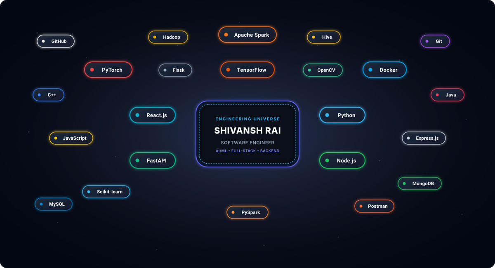

# SHIVANSH RAI

**Software Engineer • AI/ML • Full-Stack Development**

  <em>Building practical AI/ML systems and software products.</em>

  <a href="https://github.com/Shivansh-003"><strong>GitHub</strong></a> &nbsp;•&nbsp;
  <a href="https://www.linkedin.com/in/shivanshrai11/"><strong>LinkedIn</strong></a> &nbsp;•&nbsp;
  <a href="mailto:shivanshrai183@gmail.com"><strong>Email</strong></a>

 

  

---

### 🪐 `> whoami`

**B.Tech in Information Technology** @ Vellore Institute of Technology, Vellore *(2023 – 2027)*  
I build AI/ML systems, backend APIs, and full-stack applications with a focus on practical, production-oriented engineering.

---

### ⚙️ Tech Stack

<table>
  <tr>
    <td width="20%"><strong>Languages</strong></td>
    <td><code>Python</code> &bull; <code>Java</code> &bull; <code>C++</code> &bull; <code>JavaScript</code></td>
  </tr>
  <tr>
    <td><strong>AI / ML</strong></td>
    <td><code>TensorFlow</code> &bull; <code>PyTorch</code> &bull; <code>OpenCV</code> &bull; <code>Scikit-learn</code></td>
  </tr>
  <tr>
    <td><strong>Frontend</strong></td>
    <td><code>React.js</code> &bull; <code>HTML5</code> &bull; <code>CSS3</code></td>
  </tr>
  <tr>
    <td><strong>Backend</strong></td>
    <td><code>Node.js</code> &bull; <code>Express.js</code> &bull; <code>FastAPI</code> &bull; <code>Flask</code></td>
  </tr>
  <tr>
    <td><strong>Data</strong></td>
    <td><code>MySQL</code> &bull; <code>MongoDB</code> &bull; <code>Hive</code> &bull; <code>Apache Spark</code> &bull; <code>PySpark</code> &bull; <code>Hadoop</code></td>
  </tr>
  <tr>
    <td><strong>Tools</strong></td>
    <td><code>Git</code> &bull; <code>GitHub</code> &bull; <code>Docker</code> &bull; <code>Postman</code></td>
  </tr>
  <tr>
    <td><strong>Core</strong></td>
    <td><code>DSA</code> &bull; <code>OOP</code> &bull; <code>DBMS</code> &bull; <code>REST APIs</code></td>
  </tr>
</table>

---

### 🏆 Featured Work

#### 🛡️ AI-Powered Blockchain Counterfeit Medicine Detector
`PATENT GRANTED` &bull; `85% Recall` &bull; `76% F1-score`  
`Python` &bull; `TensorFlow` &bull; `OpenCV` &bull; `Flask` &bull; `Web3.py` &bull; `Solidity`  
*AI-driven packaging anomaly classification pipeline integrated with Ethereum smart contracts for tamper-proof provenance.*

 

#### 🌊 Multi-Modal Oil Spill & Cyclone Prediction API
`PyTorch` &bull; `FastAPI` &bull; `Scikit-learn` &bull; `Docker` &bull; `Nginx`  
*Production-grade multi-modal ML service serving satellite imagery segmentation (UNet++) and wind-speed forecasting models.*

 

#### 🏥 Hospital Readmission Risk Prediction
`Apache Spark` &bull; `PySpark` &bull; `Hadoop` &bull; `Hive` &bull; `MLlib`  
*Distributed machine learning pipeline predicting 30-day readmission risk across 100K+ patient records with HiveQL feature engineering.*

---

### 💼 Experience

- **2026** &bull; **Frontend Engineer Intern** — Extramarks Education India Pvt. Ltd. *(April 2026 – June 2026)*
- **2025** &bull; **Full Stack Development Intern** — Oswal Greentech Limited *(May 2025 – June 2025)*

---

### 🔗 Connect

  <a href="https://github.com/Shivansh-003"><strong>GitHub (Shivansh-003)</strong></a> &nbsp;•&nbsp;
  <a href="https://www.linkedin.com/in/shivanshrai11/"><strong>LinkedIn (shivanshrai11)</strong></a> &nbsp;•&nbsp;
  <a href="mailto:shivanshrai183@gmail.com"><strong>shivanshrai183@gmail.com</strong></a>

